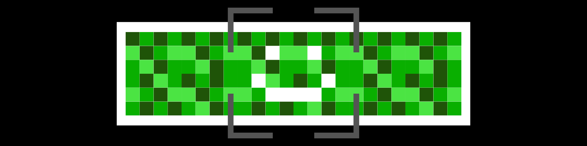

[](https://github.com/rahfianugerah/sch-bot/blob/main/LICENSE)


<div align="center">
  
  <h3>
    Commit Wave
  </h3>
  <p>
    An awesome bot that will maintain your github contribution history
  </p>
</div>

#### Project Overview
<p align="justify">
  Commit Wave is an automation tool designed to help developers keep their GitHub contribution history consistently active and engaging. By utilizing GitHub Actions or JavaScript based, this bot automates the process of generating and pushing commits at random intervals (GitHub Action & JavaScript) within a user-defined date range (JavaScript).
</p>

#### Key Features
- Automatic Commit Scheduling: Automatically executes commits.
- Randomized Commit Timing: Commits are made at random times each day to simulate consistent activity without a predictable pattern.
- Date Interval Commit: Commits are spaced out based on a configurable date interval.
- Commit Graph Maintenance: Keeps the GitHub commit graph full and active.
- Simple Configuration: Easy setup with minimal configuration required to start automating commits.

#### Getting Started
<p align="justify">
To get started with this project, please refer to the <a href=#installation-guide>Installation Guide</a> and <a href=#interactive-bot-usage>Interactive Bot Usage</a> in the documentation. For additional information on contributing, please check out the Contributing Guidelines [N/A].
</p>

#### Disclaimer </b>
<p align="justify">
Commit Wave is designed to automate the process of creating commits to GitHub repositories. While this bot can be useful for maintaining a history of active commits, users should be aware of the potential and limitations associated with its use. This bot is intended for educational and experimental purposes. It should not be used to artificially inflate repository activity or misrepresent project progress (<b>only 1 repository that can contain this bot and you're prohibited to insert this bot to other repository</b>).
</p> 

#### Installation Guide

- Clone this repository
```
git clone https://github.com/rahfianugerah/commitwave.git
```

- Run the app
```
npm start
```

#### Interactive Bot Usage

- Enter a date range and commit(s)
```bash
> commitwave@2.0.1 start
> node index.js


 ██████╗ ██████╗ ███╗   ███╗███╗   ███╗██╗████████╗    ██╗    ██╗ █████╗ ██╗   ██╗███████╗
██╔════╝██╔═══██╗████╗ ████║████╗ ████║██║╚══██╔══╝    ██║    ██║██╔══██╗██║   ██║██╔════╝
██║     ██║   ██║██╔████╔██║██╔████╔██║██║   ██║       ██║ █╗ ██║███████║██║   ██║█████╗
██║     ██║   ██║██║╚██╔╝██║██║╚██╔╝██║██║   ██║       ██║███╗██║██╔══██║╚██╗ ██╔╝██╔══╝
╚██████╗╚██████╔╝██║ ╚═╝ ██║██║ ╚═╝ ██║██║   ██║       ╚███╔███╔╝██║  ██║ ╚████╔╝ ███████╗
 ╚═════╝ ╚═════╝ ╚═╝     ╚═╝╚═╝     ╚═╝╚═╝   ╚═╝        ╚══╝╚══╝ ╚═╝  ╚═╝  ╚═══╝  ╚══════╝

Commit Wave: Hello! I am your commit bot.
Commit Wave: Please enter the start date (YYYY-MM-DD): 
2025-08-01
Commit Wave: Please enter the end date (YYYY-MM-DD): 
2025-08-02
Commit Wave: How many commits would you like to make? 
1
Commit Wave: Great! I will make 1 commits from 2025-08-01 to 2025-08-02.
Commit Wave: Starting commits between Fri Aug 01 2025 and Sat Aug 02 2025...
Commit Wave: Committed with date: Fri Aug 01 17:52:05 UTC 2025
To https://github.com/rahfianugerah/commitwave
   81735e8..bc3f781  main -> main
Commit Wave: All commits are done. Pushed to remote successfully.
```

#### Bot Script (Github Actions Script)

<p align="justify">
The Commit Wave project leverages a GitHub Actions script to automate commit operations. This script is configured to run on a schedule, performing 1-2 commits daily at random times. By utilizing GitHub Actions, the script ensures seamless integration with GitHub’s ecosystem, automatically pushing changes to maintain an active commit graph. The script is designed for simplicity and reliability, making it easy to set up and manage automated commits directly within your GitHub repository.
</p>

```yml
name: Commit Wave

on:
  schedule:
    - cron: '0 0 * * *'
    
jobs:
  commit:
    runs-on: ubuntu-latest
    steps:
      - name: Checkout repository
        uses: actions/checkout@v2

      - name: Set up Git
        run: |
          git config --global user.name 'username'
          git config --global user.email 'youremail@email.com'

      - name: Random number generation
        id: random
        # Generates a random number between 1 to 2
        run: echo "::set-output name=random_number::$(shuf -i 1-2 -n 1)" 

      - name: Make commits
        run: |
          for ((i=0; i<${{ steps.random.outputs.random_number }}; i++)); do
            echo "$(date)" >> commit.txt
            git add commit.txt
            git commit -m "Automated Commit at $(date)"
          done
          git push

```

#### Time Configuration

<p align="justify">
Commit Wave allows you to customize the timing of automated commits through flexible time configuration settings. You can specify the frequency and interval between commits. The tool ensures that commits are made at random times within the defined intervals, maintaining a dynamic and active commit graph. Below are the default example of the time configuration and you a can adjust the timing anytime you like:
</p>

- Runs at midnight every day (00:00 UTC)
```yml
on:
  schedule:
    - cron: '0 0 * * *'
```

- Runs at 6 hours a day
```yml
on:
  schedule:
    - cron: '0 */6 * * *'
```


#### License
<p align="justify">
This project is licensed under the MIT License. This means you are free to use, copy, modify, merge, publish, distribute, sublicense, and/or sell copies of the Software. The full text of the license is available in the <a href="https://github.com/rahfianugerah/commitwave/blob/main/LICENSE">LICENSE</a> file. By using this project, you agree to include the license notice and disclaimers in all copies or substantial portions of the Software. For more details on the terms and conditions of the MIT License, please refer to the license file.
</p>

#### Project Author
GitHub: [@rahfianugerah](https://www.github.com/rahfianugerah)
